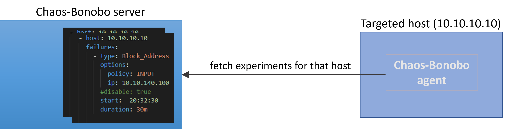

## About Chaos Bonobo

Chaos Bonobo is a framework for implementing and scheduling the injection of failures and disruptions in the normal operation of hosts.  
These induced failure scenarios constitute controlled experiments, through which we intend to test the behaviour of a system to possible mishaps 
and uncover any systemic weaknesses.   

This is the subject matter and goal of [**Chaos Engineering**](https://principlesofchaos.org/) as a discipline:
> *Chaos Engineering is the discipline of experimenting on a system in order to build confidence in the system’s capability to withstand turbulent conditions in production.*

## Architecture

Chaos Bonobo consists of two types of components. One central Server and multiple agents.  
The <u>Server</u> should run on a separate host, and it is where the user will schedule which experiments should be executed on which targeted hosts, when to be triggered and for how long.  

The <u>Agents</u> should be distributed on the hosts under test. These are *active agents* that will be querying the Server for *failure instructions*, once every 5 minutes. The Agents incorporate the *recipe* for executing the ordered experiments, when the trigger time arrives.  

If the Agents lose connection with the Server (e.g. the Server is stopped) for more than a configured time (ref. [TOLERANCE](installation.md#agent-configuration) setting), the Agents will remove any already scheduled experiments. This way, by stopping the Server, all planned experiments will get cancelled.  

The configurable tolerance serves for the continuation of experiments that will momentarily bring a host to an air-gapped state (e.g. bringing the host's network down). In that case, the tolerance should be set to be larger than the duration of such disruption scenarios.   

The Agents will send notifications over to the Server, about important events like the actual start of an experiment, its termination, or possible failures.  That way the Server is a common place where the reporting of all conducted experiments are collected. In the event when an Agent looses connection with the Server (e.g. during an experiment of disabling its network) and the Agent wishes to send a message to the Server, these messages will be buffered, until the Agent restores its connection with the Server. They will be then sent to the Server, but with the timestamp of the originally intended time of delivery.  

